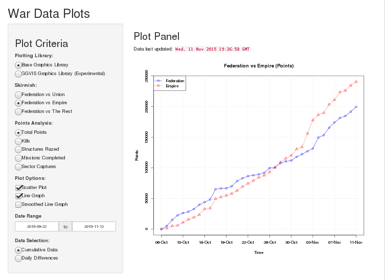

```{r echo=FALSE}
# Ensure the following is wide enough for slide output.
options(knitr.package.width=80)
```
### Pardus, War and War Points
* Pardus: a graphical Massive Multiplayer Online Browser Game
* Set in a futuristic universe where all players pilot a space ship
* Players of three factions strive to gain wealth and fame
* Various professions: traders, fighters, pirates, smugglers, other...

#### 2015: War in the Artemis Universe
* September 2015: War breaks out between the Federation and the Union
* October 2015: The Empire declares war on the Federation in response

#### Faction members earn war points for their heroic actions

* Q. How to track the three factions' progress during the two concurrent wars?

---
#### Data Gathering
* Data screen-scraped from the game's web pages

```{r echo=FALSE}
load('FederationEmpireWar.Rda')
tail(fe, n=4)
```

```{r 'FedEmpWarPoints', echo=FALSE, fig.width=4, fig.height=4}
source('../../Shiny/ShinyApps.io/ArtemisWar2015/plotter.R')

plotAttribute_base(fe,
                   attribute   = 'Points',
                   title       ='Federation vs Empire',
                   dateRange   = c(as.Date('2015-10-18'), as.Date('2015-10-27')),
                   plotOptions = c('SP'),
                   dataSet     = 'RAW',
                   loess_span  = 0.85)

```
* Started off with one-off graph plots, then evolved into...

---
#### Shiny Application



---
#### Rounding Off

* Simple plots evolved into more complex plots
* War points often required breakdown by category (kills, missions, sectors captured)
* Gathered data used to derive trend lines
* Daily differences visualised to establish which faction has the momentum
* Shiny enlisted to turn these requirements into a web application
* Interactive plots
 * Clearer progress analysis
 * Aid to strategic planning
 * Hours of fun
* Try the application out at [Shinyapps.io](https://jdirrhind.shinyapps.io/ArtemisWar2015)
* View the source code on [GitHub](https://github.com/jdirrhind/ArtemisWar2015)
* This presentation built using [Slidify](http://slidify.org). Thanks for reviewing!
